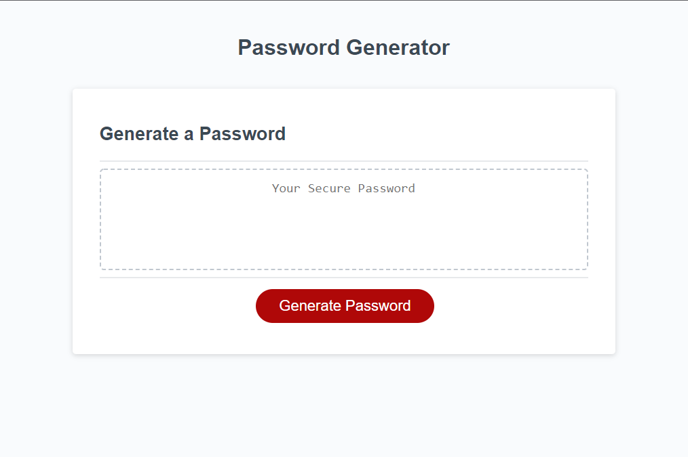

# Challenge Three Passwordword Generator

## Purpose
A website to generate a password from several parameters

## Description
In this project JavaScript techniques were taken to generate a password from any combination of the following character sets:
* Lowercase
* Uppercase
* Numeric
* Special characters

## Walkthrough
1. User clicks on the "Generate Password" button
2. The user is prompted to enter a number 8 through 128, this is the length of their password
3. The user chooses their character sets from any or all of four prompts
4. A password is repeatedly generated randomly with the desired characters and then tested against applicable regex to determine if the password includes at least one of each included character set
5. Once a password is verified to meet user criteria it is displayed in the password textbox

## Built With
* HTML
* CSS
* JavaScript

## Website
You can view the live deployment [HERE](https://esimondet.github.io/challenge-three-password-generator/)

## Screenshot of landing page

## Contribution
HTML and CSS supplied by the U of M Bootcamp
Javascript by Edison Simondet